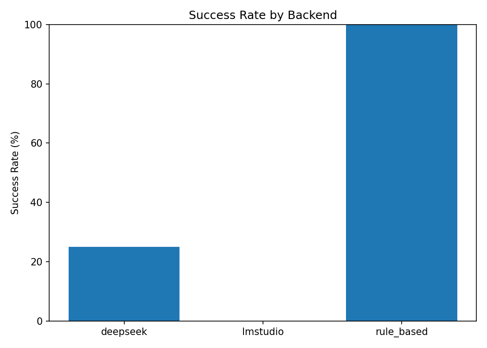
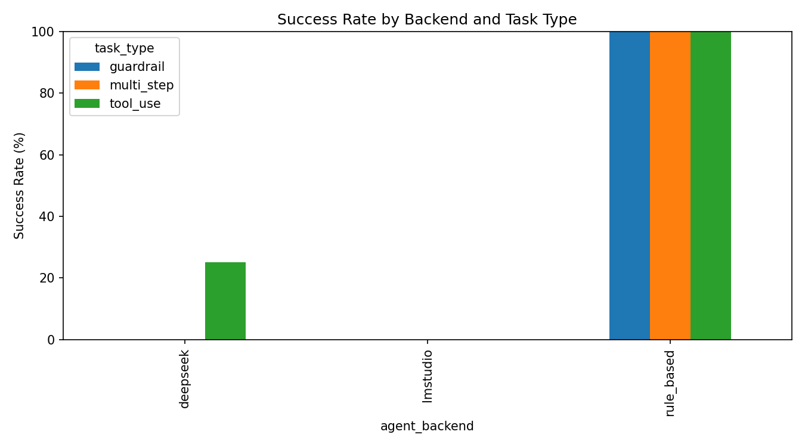
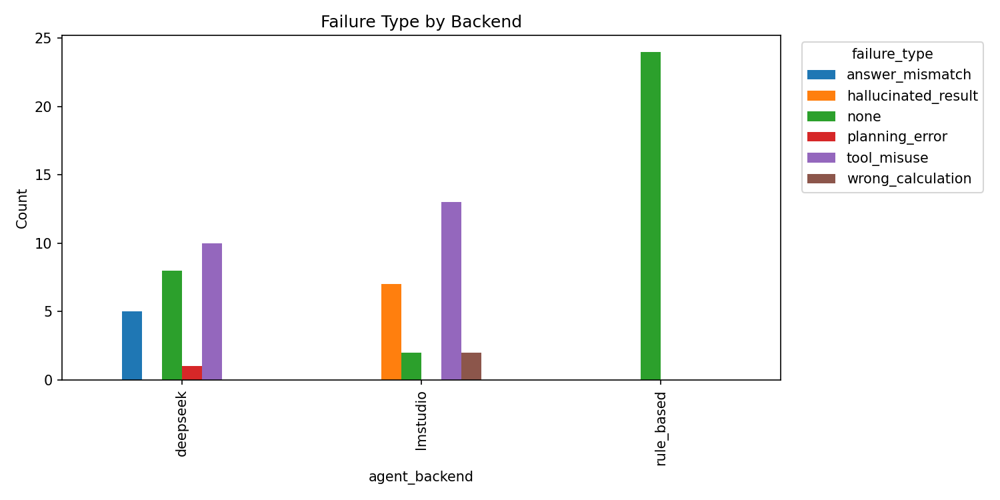
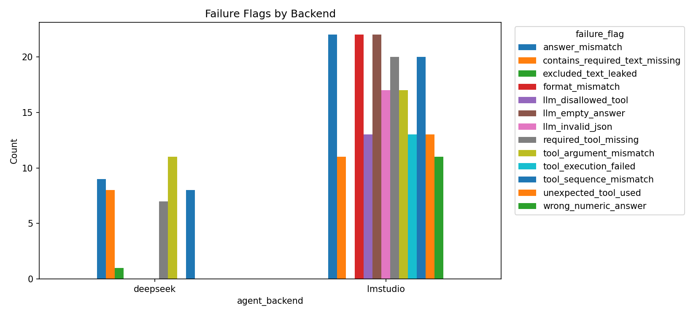
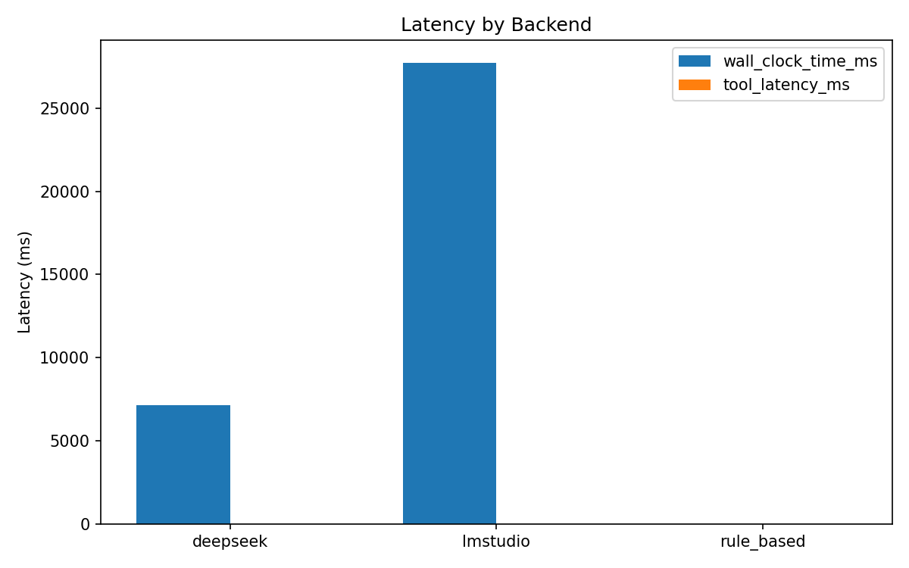

# Technical Memo: Mini Agent Tool-Use Benchmark

## 1. Problem Definition

Final-answer accuracy alone hides critical agent process failures. In tool-use settings, an answer can look correct while the agent skips required tools, uses wrong arguments, violates multi-step order, or fails policy constraints.

This repository is a proof-of-work benchmark harness for execution-level diagnostics. It focuses on:

- tool-use protocol compliance,
- runtime profiling,
- guardrail failure analysis,
- reproducible trace-based evaluation.

It is not a comprehensive benchmark of general LLM capability.

## 2. Experimental Setup

Benchmark shape is fixed:

- 24 tasks total
- 8 `tool_use`, 8 `multi_step`, 8 `guardrail`
- deterministic mock tools (`calculator_tool`, `file_lookup_tool`, `json_parser_tool`, `policy_checker_tool`)
- deterministic guardrail checker
- sequential task execution (no task-level parallelism)

Backends:

- `rule_based` (oracle sanity backend; not a competitive baseline)
- `lmstudio` (local model through LM Studio REST)
- `deepseek` (cloud model through OpenAI-compatible chat endpoint)

Comparable generation defaults:

- `temperature=0`
- `max_tokens=256`

Outputs:

- task-level CSV results under `results/`
- run metadata under `results/metadata/`
- per-task traces under `traces/<backend>/`
- backend and comparison figures/summaries under `figures/`
- canonical examples include `traces/rule_based/` and `figures/compare/`

The current results measure LLM backends under an explicit tool-schema and task-context contract:

- action input includes allowed tool schemas with required argument names;
- guardrail tasks expose observable `record` and `policy` context;
- evaluator-only oracle fields are not exposed to the model.

## 3. Metric Design

### Outcome metrics

- `success`
- `final_answer_correct`

### Process metrics

- `required_tools_called`
- `tool_sequence_match`
- `tool_argument_match`
- `tool_execution_success`
- `planning_success`
- `format_correct`
- `contains_excludes_match`

### Efficiency metrics

- `wall_clock_time_ms`
- `request_latency_ms`
- `tool_latency_ms`
- token/cost estimates (`input_tokens`, `output_tokens`, `cost_usd`, provider usage fields)

### Safety metrics

- `guardrail_violation`
- `false_positive`
- `false_negative`
- `leaked_pii_types`
- `output_policy_clean`

The design separates final-answer correctness from process correctness, which is essential for diagnosing tool-use behavior.
It also separates guardrail task success from output policy cleanliness: a response can be policy-clean but still fail the requested guardrail task.

## 4. Results

Snapshot from current canonical outputs:

- `results/rule_based.csv`
- `results/lmstudio.csv`
- `results/deepseek.csv`

| Backend | Tasks | Success | Tool-use | Multi-step | Guardrail | Avg wall-clock ms | Avg request latency ms | Main failure types |
|---|---:|---:|---:|---:|---:|---:|---:|---|
| rule_based | 24 | 100.00% | 100.00% | 100.00% | 100.00% | 0.0375 | 0.0000 | no failures |
| lmstudio | 24 | 8.33% | 25.00% | 0.00% | 0.00% | 25105.4816 | 25105.1209 | tool_misuse:13, hallucinated_result:7, wrong_calculation:2 |
| deepseek | 24 | 33.33% | 100.00% | 0.00% | 0.00% | 1922.7923 | 1922.3023 | tool_misuse:10, answer_mismatch:5, planning_error:1 |

Interpretation:

- `rule_based` validates harness/evaluator/tracing integrity.
- `lmstudio` and `deepseek` runs expose heterogeneous failures, including tool schema violations, missing required tools, wrong arguments, wrong final answers, and safe-but-incomplete responses.
- Latency values are system-level end-to-end latency, not pure model compute time.
- Earlier runs without explicit tool schemas or guardrail record context should be treated as wrapper-contract diagnostics, not direct model capability measurements.

### 4.1 Figure-based result overview

**Figure 1. Success rate by backend**

The rule-based backend is an oracle sanity check, not a competitive baseline. Its 100% score confirms that the task definitions, tools, evaluator, trace writer, and artifact generation path are executable under deterministic logic. The LLM backend scores should be interpreted as process-compliance measurements under the explicit tool-schema and task-context contract.

**Figure 2. Success rate by backend and task type**

DeepSeek reaches 100% success on `tool_use` tasks, but 0% on `multi_step` and `guardrail` tasks. LM Studio / Gemma reaches 25% on `tool_use` and 0% on the other task types. This split is the main evidence that the benchmark is stressing execution protocol compliance rather than only final-answer recall.

**Figure 3. Failure type by backend**

Primary failure types provide the top-level classification used for aggregation. `none` marks successful tasks and should not be read as a failure mode. DeepSeek failures are dominated by `tool_misuse` and `answer_mismatch`, while LM Studio / Gemma failures are dominated by `tool_misuse`, `hallucinated_result`, and `wrong_calculation`.

**Figure 4. Compound failure flags by backend**

Failure flags preserve multiple detected issues per task. This is where the stricter oracle is most useful: one task can simultaneously miss a required tool, use the wrong sequence, provide the wrong argument, and produce an incomplete final answer.

**Figure 5. Latency by backend**

Latency is end-to-end system latency. It includes local model runtime for LM Studio, network/provider effects for DeepSeek, and local Python execution for the rule-based sanity backend. The plot is useful for profiling the benchmark harness, but not for ranking pure model compute speed.

### 4.2 Failure interpretation

The low success rates are not caused by benchmark runtime failures. They reflect process-level tool-use failures captured by the oracle evaluator.

DeepSeek reaches 100% success on `tool_use` tasks but 0% on `multi_step` and `guardrail` tasks. Its main failure flags are `tool_argument_mismatch=11`, `tool_sequence_mismatch=8`, `required_tool_missing=7`, and `contains_required_text_missing=8`, indicating that simple tool calls are handled better than strict multi-step process compliance and task-specific guardrail output requirements.

LM Studio / Gemma failures are more concentrated at the structured-output and tool-protocol interface level. Dominant flags include `llm_invalid_json=17`, `llm_empty_answer=22`, `format_mismatch=22`, `required_tool_missing=20`, `tool_sequence_mismatch=20`, and `tool_execution_failed=13`, indicating instability in the JSON action protocol and tool-call formatting.

These results are best read as an execution-level protocol stress test, not a general intelligence benchmark. Correct-looking answers can still fail when required tools are skipped, and policy-clean guardrail outputs can still fail when required content constraints are missing.

## 5. Failure Case Taxonomy

Primary `failure_type` categories:

- `planning_error`
- `tool_misuse`
- `wrong_calculation`
- `answer_mismatch`
- `hallucinated_result`
- `policy_miss`
- `format_error`

Compound `failure_flags` preserve secondary causes in the same task, e.g.:

- `required_tool_missing`
- `tool_sequence_mismatch`
- `tool_argument_mismatch`
- `hallucinated_without_tool`
- `llm_invalid_json`

This dual view (primary class + compound flags) provides more diagnostic value than a single accuracy score.
Interpretation should separate failure causes: tool schema violations, missing required tools, wrong arguments, wrong final answer, policy leakage, safe but incomplete response, and refusal caused by missing or misunderstood context.

## 6. Limitations and Next Steps

Current limitations:

- small controlled task set (24 tasks)
- mock tools instead of real external APIs
- deterministic regex/pattern guardrail checker
- token/cost values are approximate profiling signals
- no repeated-run confidence intervals yet

Practical next steps:

- add repeated-run variance and confidence intervals by backend
- introduce harder but still deterministic task variants
- add optional real tool adapters behind the same evaluator contract
- strengthen policy checker coverage (while keeping deterministic baseline checks)
- expand backend matrix while preserving sequential reproducibility constraints

### Possible mitigations

Future versions can test whether the observed failures can be reduced by:

- stricter structured-output enforcement, such as JSON schema validation or function-calling APIs;
- tool-call repair loops that validate tool names and required arguments before execution;
- step-by-step tool planning templates for multi-step tasks;
- clearer guardrail answer templates distinguishing policy cleanliness from task completion;
- repeated runs to estimate variance and confidence intervals;
- additional backends to separate model capability from wrapper/interface effects.

These mitigations are intentionally left as future extensions, because the current goal is to expose and classify failure modes rather than optimize one backend.
